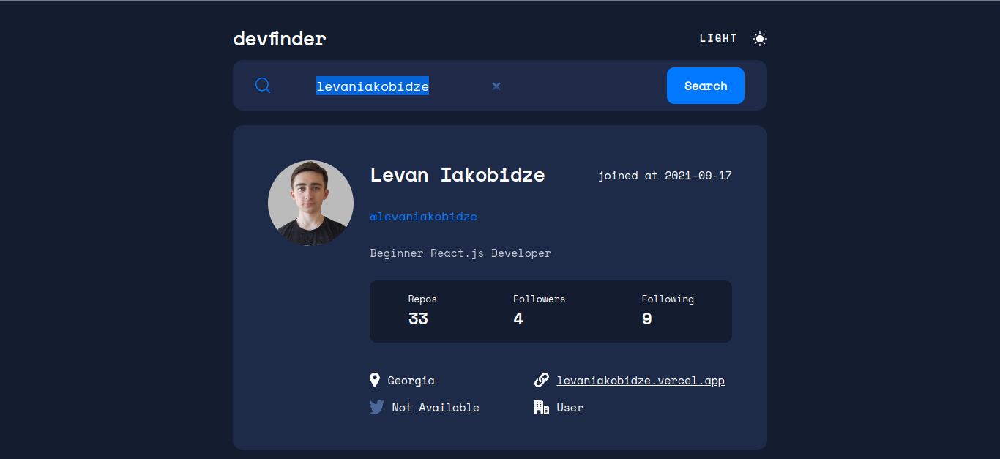

## Overview

### The challenge

Users should be able to:

- View the optimal layout for the app depending on their device's screen size
- See hover states for all interactive elements on the page
- Search for GitHub users by their username
- See relevant user information based on their search
- Switch between light and dark themes
- **Bonus**: Have the correct color scheme chosen for them based on their computer preferences. _Hint_: Research `prefers-color-scheme` in CSS.

### Screenshot

### Links

- Solution URL: [Add solution URL here](https://github.com/levaniakobidze/Github_search_api)
- Live Site URL: [Add live site URL here](https://githubsearchlevan.vercel.app/)

## My process

### Built with

- Semantic HTML5 markup
- CSS custom properties
- Flexbox
- CSS Grid
- [React](https://reactjs.org/) - JS library
- [Css] - For styles

### What I learned

- while working on this project I learned how to fetch data with api,
- How to make a request on the server and also this was my first time experience - working on dark and light mode.

## Author

- Website - [Portfolio](https://levaniakobidze.vercel.app/)
- Github - [@LevanIakobidze](https://github.com/levaniakobidze)
- Linkedin - [@yourusername](https://www.linkedin.com/in/levan-iakobidze-b0b60923b/)
